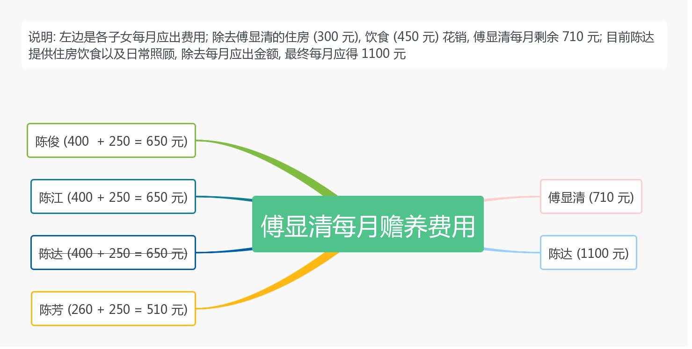

### 傅显清赡养方案
为避免歧义, 以下全文涉及人员全由姓名相称

#### 历史问题
这里暂时空下来, 如果想扯一扯那咱就认真扯一扯, 把陈芝麻烂谷子的事都掰扯明白

#### [赡养](https://baike.baidu.com/item/%E8%B5%A1%E5%85%BB%E4%B9%89%E5%8A%A1)
子女对父母履行赡养义务, 赡养是指子女在物质上和经济上为父母提供必要的生活条件, 子女作为赡养人, 应当履行对老年人经济上供养, 生活上照料和精神上慰藉的义务, 照顾老年人的特殊需要; 儿子和女儿都有义务赡养父母; 由此可知, 对老人的赡养可分为以下方面
##### 经济
>即每个子女提供给老人经济上的保证, 这部分钱主要花在老人的衣食住行等方面

以下链接是被赡养人当前居住省份发布的最低工资标准: [2018 年新疆最低工资标准](http://www.gov.cn/xinwen/2018-03/27/content_5277816.htm); 这里我们选择包含三险一金的最低档次 **1460**, 即傅显清的四位子女需每月提供以上金额来保证其物质生活, 各子女出资分配如下
- **陈俊**: 400 元
- **陈江** (由 **陈澜天** 代出): 400 元
- **陈达**: 400 元
- **陈芳**: 260 元

目前陈达负责了傅显清的住房和饮食, 参照 [房屋租售比](https://baike.baidu.com/item/%E6%88%BF%E5%B1%8B%E7%A7%9F%E5%94%AE%E6%AF%94) 和 [恩格尔系数](https://baike.baidu.com/item/%E6%81%A9%E6%A0%BC%E5%B0%94%E7%B3%BB%E6%95%B0), 住房每月花费约 300 元 (使用 1/250 的租售比), 饮食每月花费约 450 元 (使用 30% 的系数); 即陈达目前为傅显清提供了每月 750 元的物质赡养, 扣除每月所出 400 元, 多出的 350 元将由其他子女所出赡养费中补偿, 剩余金额归 **傅显清** 所有

##### 生活
>即每个子女提供给老人生活上的照顾, 包括日常陪伴, 起居照顾等

傅显清年纪已快八十, 且腿脚不便, 部分生活不能自理需要人照顾; 若以新疆省不包含三险一金的最低标准请人照顾, 则每月需 1000 元; 此费用也应由傅显清的四位子女提供, 各子女出资分配如下
- **陈俊**: 250 元
- **陈江** (由 **陈澜天** 代出): 250 元
- **陈达**: 250 元
- **陈芳**: 250 元

此义务目前全由 **陈达** 一人承担, **陈俊, 陈江, 陈芳** 由于距离或其他原因不能尽到这部分义务, 所以此部分费用归 **陈达** 所有

##### 精神
>即每个子女提供给老人精神上的慰藉, 包括日常联系关心 (例如电话, 视频等)

目前大家都有条件打电话, 通视频, 此部分义务相信大家都能够做到, 所以不再赘述

##### 特殊需要
暂无

##### 赡养费用示意图

#### 医疗
傅显清目前身体尚为健康, 但后续免不了会有住院治疗, 住院产生的一系列花销说明如下
- 住院治疗的费用由四家平摊, **陈达** 提供住院费用明细单据
- 由于傅显清住院必然需要人照顾, **陈俊, 陈江, 陈芳** 由于距离或其他原因难以提供照顾, 此重任必然落在 **陈达** 身上; 作为补偿, 医保报销的金额全归 **陈达** 所有 (当然作为前提, 傅显清的医保注册和报销流程全权由 **陈达** 负责)

#### 支付及监督
每月 3 号前陈俊, 陈芳将每月所出金额支付给陈澜天, 陈澜天每月 5 号前拿给傅显清 710 元现金 (李小菊代劳), 电子支付给陈达 1100 元; 陈俊和陈芳可每月向傅显清核对赡养金额 (正好聊聊天, 而不是每年只在过年打次电话)

#### 其他
如有异议请尽快提出!!!
