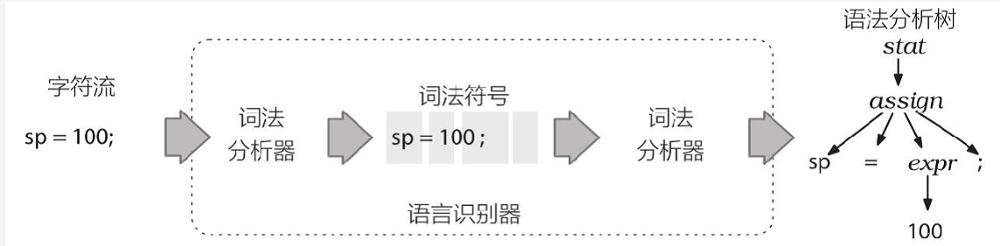
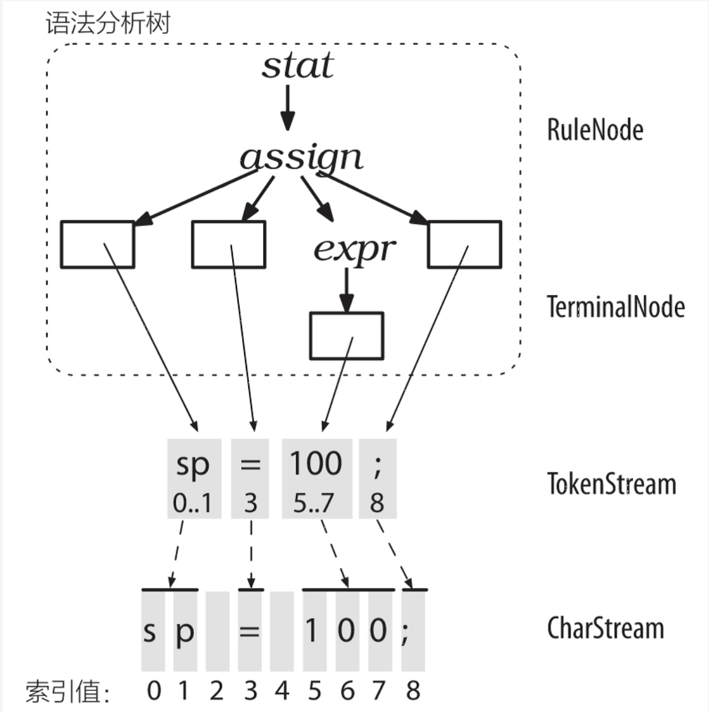
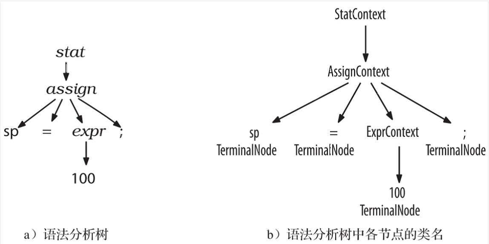
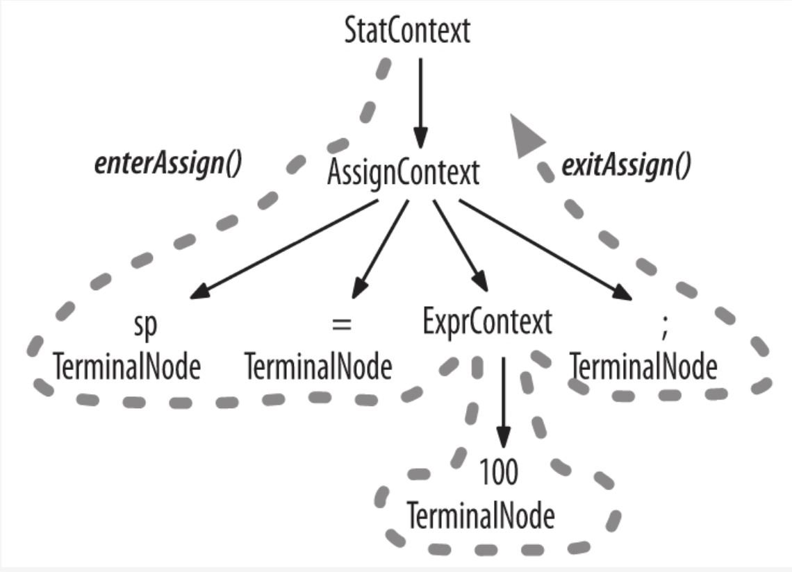
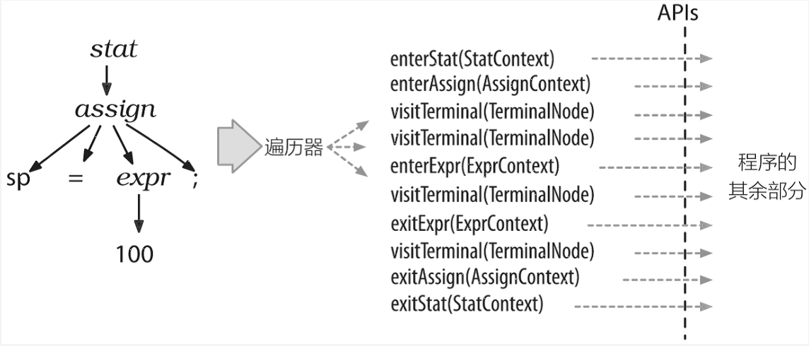
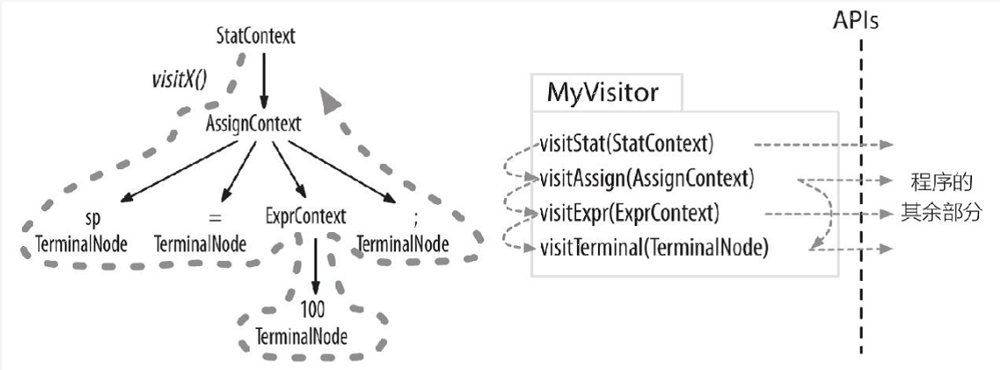

### 纵观全局

#### 从 Antlr 元语言开始
语言 (languages) 是由一系列有意义的语句组成的, 语句 (sentence) 是由词组组成的, 词组 (parase) 是由更小的子词组 (subphrase) 和词汇符号 (vocabulary symbol) 组成的; 一般来说, 如果一个程序能够分析计算或 "执行" 语句就称之为解释器 (interpreter), 例如 Python 解释器; 如果一个程序能够将一门语言的语句转换为另外一门语言的语句就称之为翻译器 (translator), 例如 Java 到 C# 的转换器或普通编译器  
为了达到预期的目的, 解释器或翻译器需要识别一门特定语言的所有的有意义的语句, 词组, 子词组; 识别一个词组意味着可以将它从众多的组成部分中辨认和区分出来; 识别语言的程序称为语法分析器 (parser) 或者句法分析器 (syntax analyzer); 句法 (syntax) 是指约束语言中的各个组成部分之间关系的规则, 这里使用 Antlr 语法来指定语言的句法; 语法 (grammar) 是一系列规则的集合, 每条规则表述出一种词汇结构; Antlr 工具能够将其转换为如同经验丰富的开发者手工构建一般的语法分析器 (Antlr 是一个能够生成其他程序的程序); Antlr 语法本身又遵循了一种专门用来描述其他语言的语法, 称之为 Antlr 元语言 (Antlr's meta-language)  
语法分析过程通常会被分解为两个相似但独立的阶段
- 词法分析 (lexical analysis)
这个过程将字符聚集为单词或者符号 (词法符号, token); 将输入的文本转换为词法符号的程序称之为词法分析器 (lexer); 词法分析器可以将相关的词法符号归类, 当语法分析器不关心单个符号而仅关心符号的类型时, 词法分析器就需要将词汇符号归类; 词法符号包含至少两部分信息: 词法符号的类型和该词法符号对应的文本
- 语法分析
这个过程中输入的词法符号被 "消费" 以识别语句结构; 默认情况下,  Antlr 生成的语法分析器会建造一种名为语法分析树 (parse tree) 或者句法树 (syntax tree) 的数据结构, 该结构记录了语法分析器识别出输入语句结构的过程, 以及该结构的各组成部分

以下展示了数据在一个语言类应用程序中的基本流动过程

语法分析树的内部节点是词组名, 这些名字用于识别它们的子节点, 并将子节点归类; 根节点是最抽象的一个名字, 即 stat (statement 的简写), 语法分析树的叶子节点永远是输入的词法符号; 由于使用一系列的规则指定语句的词汇结构, 语法分析树的子树的根节点就对应语法规则的名字; 以下语法规则就对应上图中赋值语句子树的第一级
```
assign: ID '=' expr ';' ; // 匹配一个类似 "sp = 100;" 的赋值语句
```
使用和调试 Antlr 语法的第一个基本要求是, 理解 Antlr 是如何将这样的规则转换为人类可阅读的语法分析程序的

#### 实现一个语法分析器
Antlr 工具依据类似之前的 assign 的语法规则, 产生一个递归下降的语法分析器 (recursive-descent parser); 递归下降的语法分析器实际上是若干递归方法的集合, 每个方法对应一条规则; 下降的过程就是从语法分析树的根节点开始, 朝着叶节点 (词法符号) 进行解析的过程; 首先调用的规则, 即语义符号的起始点, 就会成为语法分析树的根节点; 这种解析过程的更广为人知的名字是 "自上而下的解析", 递归下降的语法分析器仅仅是自上而下的语法分析器的一种实现  
下面是一个 Antlr 根据 assign 规则生产的方法, 用于展示递归下降的语法分析器的实现细节
```
// assign: ID '=' expr ';' ;
void assign() {  // 根据 assign 规则生成的方法
    match(ID);   // 将当前的输入符号和 ID 相比较, 然后将其消费掉
    match('=');  
    expr();      // 通过调用方法 expr() 来匹配一个表达式
    match(";");
}
```
递归下降的语法分析器通过 stat(), assign(), expr() 的调用描绘出的调用路线图映射到了语法分析树的节点上, 调用 match() 对应了语法分析树的叶子节点; 在手工构造的语法分析器中, 需要在每条规则对应的方法的开始位置插入 "增加一个新的字树根节点" 的操作, 在 match() 方法中插入 "增加一个新的叶子节点" 的操作  
assign() 方法仅仅验证所有的词汇贵妇好都存在且顺序正确; 当语法分析器进入到 assign() 方法内部时, 仅有一个备选分支 (alternative), 无须做出选择; 一个备选分支指的是规则的右侧定义的多个方案之一; 例如, 除了 assign 之外, stat 规则还可能有其他多种语句
```
// 从当前输入位置开始, 匹配多种语句
stat: assign  // 第一个备选分支 ('|' 是备选分支的分隔符)
    | ifstat
    | whilestat
```
对 stat 语法的解析就像是一个 switch 语句
```
void stat() {
    switch (<< 当前输入的词法符号 >>) {
        CASE ID: assign(); break;
        CASE IF: ifstat(); break;  // IF 是 if 关键字的词法符号类型
        CASE WHILE: whilestat(); break;
        ...
        default: << 抛出无可选方案的异常 >>
    }
}
```
stat() 方法必须通过下一个词法符号来做出语法分析决策 (parsing decision) 或者预测 (prediction); 做出决策的过程实际上就是判断哪一个备选分支是正确的; 前瞻词法符号 (lookahead token) 是下一个输入的词法符号的术语, 即指任何一个在被匹配和消费之前就由语法分析器嗅探出的词法符号, 有时候可能需要很多个前瞻词法符号来判断语义规则的哪个方案是正确的; Antlr 可以完成这些工作, 对其决策过程的理解有助于调试 Antlr 自动生成的语法分析器

#### 你再也不能往核反应堆多加水了
歧义性语句是指存在不止一种语义的语句; 换句话说, 歧义性语句中的单词序列能够匹配多种语法结构; 例如本节的标题, 让人不确定, 是已经无法往核反应堆多加水了, 还是不应该往核反应堆里多加水  
我们通过一些有歧义的语法来阐明歧义性的含义
```
stat: expr ';'  // 表达式语句, 也可以匹配 "f();"
    | ID '('')'';'  // 函数调用语句
    ;
expr: ID '('')'
    | INT
    ;
```
下图显示了 stat 规则对输入文本 "f();" 的两种不同的解释
```
f():          作为表达式                       作为函数调用
            --- stat ---                      --- stat ---
            |          |                      |   |   |  |
        - expr -       ;                      f   (   )  ;
        |  |   |
        f  (   )      
```
左边语法分析树展示的是 f() 匹配 expr 规则的情况, 右边语法分析树展示的是 f() 匹配 stat 规则的第二个备选分支的情况; 由于大多数语言的设计者都倾向于将语法设计成无歧义的, 一个歧义性语法通常被认为是程序设计上的 bug; 通常的解决方法是重新组织语法将其设计为无歧义的, 而 Antlr 解决歧义的方法是: 选择所有匹配的备选分支中的第一条; 词法分析器和语法分析器中都可能发生这样的情况, Antlr 的解决方案使得对规则的解析能够正常进行, 除此之外, 词法分析器会匹配可能的最长字符串来生成一个词法符号

#### 使用语法分析树来构建语言类应用程序
为编写一个语言类应用程序, 我们必须对每个输入的词组或者子词组执行一些适当的操作, 进行这项工作最简单的方式是操作语法分析器自动生成的语法分析树
前已述及, 词法分析器处理字符序列并将生成的词法符号提供给语法分析树, 语法分析器随即根据这些信息来检查语法的正确性并建造出一颗语法分析树; 这个过程对应的 Antlr 类是 CharStream, Lexer, Token, Parser, 以及 ParseTree; 连接词法分析器和语法分析器的 "管道" 是 TokenStream
  
r图中也显示出 ParseTree 的子类是 RuleNode 和 TerminalNode, 二者分别是子树的根节点和叶子节点; 为了更好的支持对特定节点的元素的访问, Antlr 会为每条规则生成一个 RuleNode 的子类

根节点包含了使用规则识别词组过程中的全部信息, 它们被称为上下文 (context) 对象; 每个上下文对象都知道自己识别出的词组中, 开始和结束位置处的词法符号, 同时提供访问该词组全部元素的途径;

#### 语法分析树监听器和访问器
Antlr 的运行库提供了两种遍历树的机制; 默认情况下, Antlr 使用内建的遍历器访问生成的语法分析树, 并为每个遍历时可能触发的事件生成一个语法分析树监听器接口 (parse-tree listener interface), 一个监听器的方法实际上就是回调函数; 除了监听器方式, 还将介绍另外一种遍历语法分析树的方式: 访问者模式 (vistor pattern)

##### 语法分析树监听器
为了将遍历树时触发的事件转化为监听器的调用, Antlr 运行库提供了 ParseTreeWalker 类; 我们可以自行实现 ParseTreeListener 接口, 在其中填写逻辑代码, 从而构建出自己的语言类应用程序  
Antlr 为每个语法文件生成一个 ParseTreeListener 的子类, 在该类中, 语法中的每条规则都有对应的 enter 方法和 exit 方法; 例如, 当遍历器访问到 assign 规则对应的节点时, 它就会调用 enterAssign() 方法, 然后将对应的语法分析树节点 (AssignContext 实例) 当作参数传递给它, 在遍历器访问了 assign 节点的全部子节点之后, 会调用 exitAssign() 方法  

下图显示了在赋值语句生成的语法分析树中, ParseTreeWalker 对监听器方法的完整的调用顺序

监听器的优秀之处在于, 这一切都是自动进行的, 不需  要编写语法分析树的遍历代码, 也不需要监听器显式的访问子节点

##### 语法分析树访问器
有时候我们希望控制遍历语法分析树的过程, 通过显式的方法调用来访问子节点; 在命令行中加入 -visitor 选项可以指示 Antlr 为一个语法生成访问器接口 (visitor interface), 语法中每条规则对应接口中的一个 visit 方法

我们可以在在自己的应用程序中实现这个访问接口, 来开始对语法分析树分遍历
